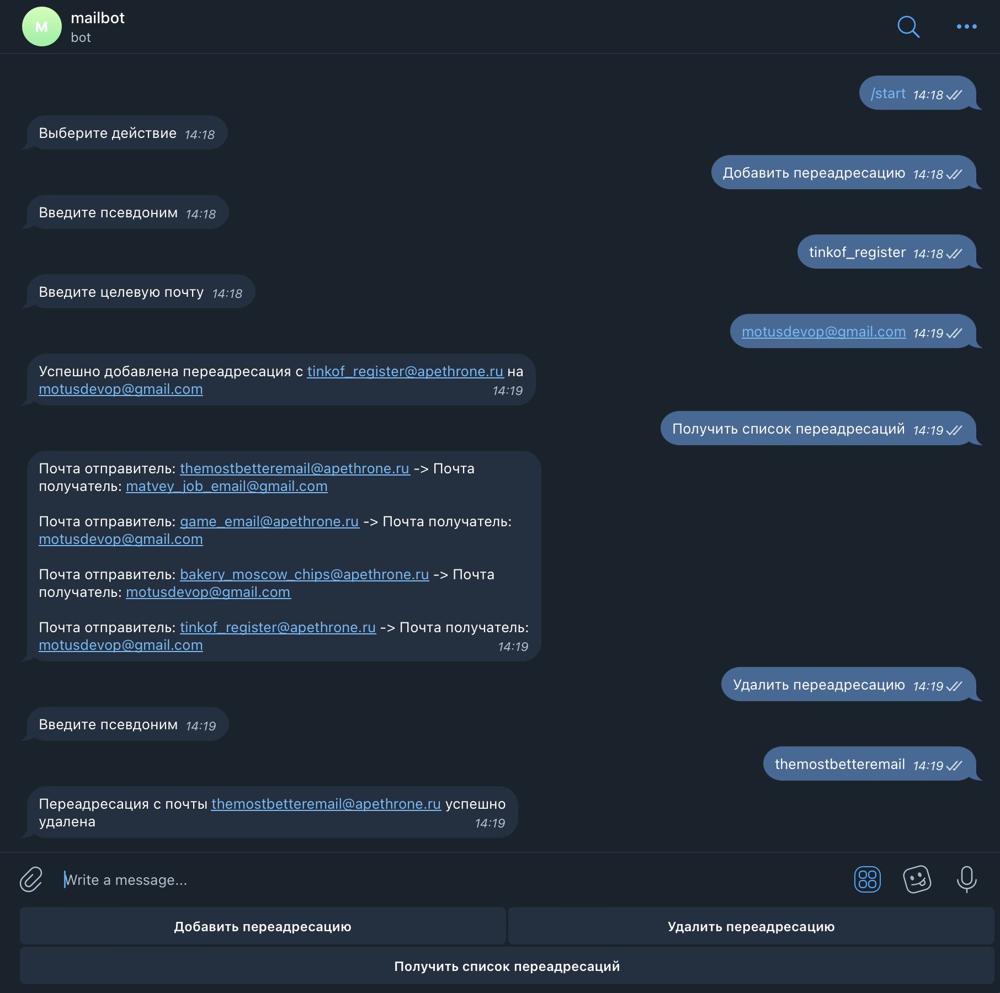

# Project Name: Telegram Address Mask Bot

 

## Description
This project is a Telegram bot that generates masks for real postal addresses for the users of this bot. This allows users to achieve anonymity and protection against hacking. The service also solves the problems of creating multiple email addresses and passwords for them.

## Описание
Этот проект представляет собой телеграм-бот, который генерирует маски для реальных почтовых адресов для пользователей этого бота. Это позволяет пользователям достичь анонимности и защиты от взлома. Сервис также решает проблемы создания нескольких электронных адресов и паролей для них.

## Features
- Generates masks for real postal addresses
- Provides anonymity and protection against hacking
- Solves the problems of creating multiple email addresses and passwords

## Возможности
- Генерирует маски для реальных почтовых адресов
- Обеспечивает анонимность и защиту от взлома
- Решает проблемы создания нескольких электронных адресов и паролей

## Usage
To use the Telegram Address Mask Bot, follow these steps:
1. Start a chat with the bot on Telegram
2. Follow the instructions provided by the bot to generate address masks
3. Use the generated address masks for anonymity and protection

## Использование
Чтобы использовать телеграм-бота для маскировки адресов, выполните следующие шаги:
1. Начните чат с ботом в Telegram
2. Следуйте инструкциям, предоставленным ботом, чтобы сгенерировать маски адресов
3. Используйте сгенерированные маски адресов для анонимности и защиты